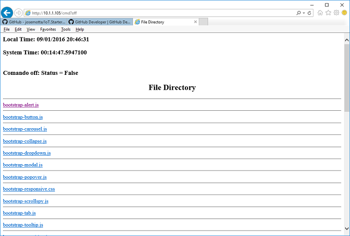

<h1>IoT Starter Core for Netduino Plus 2</h1>

<h2>Introduction</h2>

In the world there are tenths billions of smart devices connected to the Internet right now, including all sizes of computers, tablets, cell phones, smart watches, pagers, etc. The IoT technology expects to double this quantity before 2020, which represents a $6 trillion market to be developed in the next few years.

IoT development definitely challenges us to behave differently, compared to current computing environment, based on human interaction with screen, touch, keyboard and mouse. The difference is that IoT devices should interact directly with nature, processing data in a real time basis.

The development process is expected to be more complex and may require proper tools for developers. Did you consider buying an oscilloscope for debugging? In order to speed up the IoT development, this article introduces a IoT Starter Kit that may help to speed up an IoT initiative.

Sources&nbsp;are available&nbsp;at Github repository <strong itemprop="name" style="font-weight: 600; box-sizing: border-box;"><a data-pjax="#js-repo-pjax-container" href="https://github.com/josemotta/IoT.Starter.Np2.Core" style="color: rgb(64, 120, 192); text-decoration: none; box-sizing: border-box; background-color: transparent;">IoT.Starter.Np2.Core</a>.</strong>

<h2>Background</h2>

Supposing you are trying to become an IoT entrepreneur, how to minimize the risks for an IoT initiative? How to satisfy users, investors and decision makers that support your&nbsp;&quot;idea&quot; for&nbsp;an IoT project? It is&nbsp;common knowledge that some wise steps may&nbsp;reduce the risks:

<ul>
	<li>Business Plan</li>
	<li>Team</li>
	<li>Methodology</li>
	<li>Proof of Concept</li>
	<li>Starter Kit</li>
	<li>Pilot</li>
	<li>Commercial</li>
</ul>

Then, suppose the original &quot;idea&quot; has grown enough to fit in a profitable business plan and it was accepted by the investors. After that, an executive manager get involved and gathered a compact developer team, well trained to apply an agile methodology that assures&nbsp;a smooth and continuous workflow. Great! Where are we now?

Some time has passed since the investors came in and they are already pushing for results. We should speed up the development process to launch product as soon as possible, they say.

We just started Proof of Concept, when we expect to build the preliminary version that comply with users and investors needs. This is the first version and it should not handle all the complexity required by the final product. The goal is to generate a healthy embryo. Since methodology and team evolve the embryo continuously, we can start it small and each version will add functionality and new tests, until we reach the Pilot prototype.

At this&nbsp;moment,&nbsp;a Starter Kit may help the team to focus in the main concepts behind the IoT initiative and make it actually&nbsp;profitable. Better than that, the resources we got until now - the manager leading the team, applying the methodology for smooth workflow, all them are fully operational, ready to run,&nbsp;immediately after the Starter Kit is installed.

<h2>Building the Starter Kit</h2>

Since IoT requires smart devices connected to the Internet, we should choose the product platform, which means a <code>CPU </code>and a <code>network interface</code>. There are many nice ARM platforms today, including Arduino, Netduino and Raspberry PI, among others. The latest models added wired and/or wireless network interfaces to the processor boards, still keeping the low cost. Naturally, we should get the best one that&nbsp;fits&nbsp;our project and our budget.

We should also consider that hardware and software for the product platform should be kept minimal, just to fit the IoT initiative. Most cases include a custom hardware, maybe a daughter board or a shield added to the Arduino bus. Simulating the team workflow, we conclude that most of their time will be spent programming and testing a software application being executed on the target platform, interacting with the customized hardware.

Then,&nbsp;we need an external development system, installed on a microcomputer, in order to have:

<ul>
	<li>a programming <code>language </code>and its compiler generating code for&nbsp;the product;</li>
	<li><code>utilities </code>to load the executable code and debug it on the target platform;</li>
	<li>a library containing <code>communication </code>software, providing basic Internet&nbsp;services;</li>
	<li>a library with other <code>utilities</code>, for disk storage, for example;</li>
	<li>software library&nbsp;<code>modules</code>, developed for&nbsp;IoT, like IR codecs or sensor/motor drivers.</li>
</ul>

The&nbsp;first platform chosen to&nbsp;build a Starter Kit is Netduino Plus 2, an open-source electronics platform using the .NET Micro Framework&nbsp;running&nbsp;at 168 MHz with 1 MB Flash and 192 KB RAM.&nbsp;Please check&nbsp;<a href="http://www.codeproject.com/Articles/840511/Introduction-to-Netduino-Plus-with-examples"><u>article </u></a>from Guruprasad&nbsp;detailing&nbsp;the Netduino Plus 2.

Main reason that justifies Netduino&nbsp;is&nbsp;the&nbsp;availability of MS Visual Studio as&nbsp;a development tool. We&nbsp;should&nbsp;also mention the C#&nbsp;programming language, its&nbsp;compiler&nbsp;and the corresponding loader/debugger that&nbsp;make&nbsp;life much easier. The&nbsp;.NET software libraries also provide utilities we need to handle disks and other periferals.

To use Netduino, as <a href="http://www.netduino.com/downloads/">recommended</a>, install the development environment&nbsp;in the following order:&nbsp;

&nbsp;&nbsp; 1)&nbsp; Microsoft Visual Studio Express 2013 
&nbsp;&nbsp; 2) .NET Micro Framework SDK v4.3 
&nbsp;&nbsp; 3) .NET MF plug-in for VS2013 
&nbsp;&nbsp; 4) Netduino SDK v4.3.2.1

To&nbsp;use the Starter Kit, download it from Github&nbsp;at&nbsp;<strong itemprop="name" style="font-weight: 600; box-sizing: border-box;"><a data-pjax="#js-repo-pjax-container" href="https://github.com/josemotta/IoT.Starter.Np2.Core" style="color: rgb(64, 120, 192); text-decoration: none; box-sizing: border-box; background-color: transparent;">IoT.Starter.Np2.Core</a></strong>. Three VS projects can be found&nbsp;at the <code>Starter </code>folder:

<ul>
	<li><strong>Controller</strong>: contains the main application, described&nbsp;below;</li>
	<li><strong>FileServer</strong>: a modified version of <a href="https://www.element14.com/community/groups/arduino/blog/2012/09/05/netduino-file-server">Netduino File Server</a>, from Oneleggedredcow, to&nbsp;process files stored at&nbsp;the micro SD disk;</li>
	<li><strong>HttpLibraryV3</strong>: a modified version of <a href="http://forums.netduino.com/index.php?/topic/9139-httlibrary-v3/">HTTPLibrary V3</a>, from Nart Schinackow, including&nbsp;HttpServer and&nbsp;corresponding HttpRequest and HttpResponse.</li>
</ul>

The <strong>File Server </strong>is capable of executing the following commands:

<ul>
	<li><strong>List</strong>: lists the files that are on the netduino SD card;</li>
	<li><strong>Get</strong>: transfers a file from the netduino to the PC;</li>
	<li><strong>Put</strong>: transfers a file from the PC to the netduino;</li>
	<li><strong>Delete</strong>: deletes a file from the netduino SD card</li>
</ul>

The <strong>HttpLibrary V3 </strong>supports a simple authentication method and&nbsp;has also a NtpClient utility to&nbsp;initialize&nbsp;date and time directly from the Internet.

<h2>Controller</h2>

The expected behaviour&nbsp;from&nbsp;the starter&nbsp;is a web server that listen on&nbsp;port 80 and answer with the&nbsp;<code>index.html </code>file, loaded from SD disk. It also accepts HTTP commands from&nbsp;browser to turn <strong>on </strong>and <strong>off </strong>the board&acute;s&nbsp;<code>OnboardLed</code>. The browser response includes&nbsp;current date/time , in order to check if NtpClient is&nbsp;properly running at initialization. Then, there are three comands to test, supposing IP address below:&nbsp;

<code><a href="http://10.1.1.105/cmd?off">http://10.1.1.105/</a></code>

<code><a href="http://10.1.1.105/cmd?off">http://10.1.1.105/cmd?on</a></code>

<code><a href="http://10.1.1.105/cmd?off">http://10.1.1.105/cmd?off</a></code>

The Main() program,&nbsp;shown below, is responsible for the Starter Core functionality.&nbsp; First, it&nbsp;tries to set local time&nbsp;using <code>NtpClient.GetNetworkTime()</code>. The <code>onBoardLed</code>,<code>&nbsp;</code>used by&nbsp;Http Comand is also declared.

    public class Program
    {
        static HttpServer Server;                   // server object
        static Credential ServerCredential;         // server security
        static Configuration ServerConfiguration;   // configuration settings
        static bool status = false;                 // on board led status

        public static void Main()
        {
            TimeSpan elapsed = TimeSpan.Zero;

            // Try to get clock at system start
            try
            {
                var time = NtpClient.GetNetworkTime();
                Utility.SetLocalTime(time);
            }
            catch (Exception ex)
            {
                // Dont depend on time
                Debug.Print("Error setting clock: " + ex.Message);
            }

            // On board led
            OutputPort onBoardLed = new OutputPort(Pins.ONBOARD_LED, false);

            Thread.Sleep(1000);

            // Web Server
            ServerConfiguration = new Configuration(80);
            ServerCredential = new Credential(&quot;Administrator&quot;, &quot;admin&quot;, &quot;admin&quot;);
            Server = new HttpServer(ServerConfiguration, ServerCredential, @&quot;\SD\&quot;);
            Server.OnServerError += new OnServerErrorDelegate(Server_OnServerError);
            Server.OnRequestReceived += new OnRequestReceivedDelegate(Server_OnRequestReceived);
            Server.Start();

            // File Server
            FileServer server = new FileServer(@&quot;\SD\&quot;, 1554);

            while (true)
            {
                // null task

                onBoardLed.Write(status);
                Thread.Sleep(500);
                
            }
        }
     }

The web server is started using pre-initialized admin credentials, they will be required when browser asks for data. The File Server is also started at port 1554 to handle micro SD disk. At last, a&nbsp;null task loop updates continuously the <code>onBoardLed</code>, according to HTTP command <code>status</code>.

The Server_OnRequestReceived(), shown below, sets the <code>status</code>, depending on the HTTP command received.

        static void Server_OnRequestReceived(HttpRequest Request, HttpResponse Response)
        {
            if (Request.RequestedCommand != null)
            {
                switch (Request.RequestedCommand.ToLower())
                {
                    case &quot;on&quot;:
                        status = true;      // on board led ON
                        break;
                    case &quot;off&quot;:
                        status = false;     // on board led OFF
                        break;
                } 

                Response.WriteFilesList(&quot;&lt;br&gt;&quot; + &quot;Comando &quot; +
                    Request.RequestedCommand.ToLower() +
                    &quot;: Status = &quot; + status.ToString());
            }
            else if (Request.RequestedFile != null)
            {
                string FullFileName = Request.FilesPath + Request.RequestedFile;
                if (File.Exists(FullFileName))
                {
                    Response.WriteFile(FullFileName);
                }
                else
                {
                    Response.WriteNotFound();
                }
            }
            else
            {
                Response.WriteFile(Request.FilesPath + &quot;home.html&quot;); // TODO: product page
            }
        }

The screenshot below shows the browser after the HTTP comand sent to the connected Netduino Plus 2. The Starter is now able to establish&nbsp;core functionality and communicate with outside world. It is ready to&nbsp;be equipped with interesting&nbsp;other Things!

<h2>Points of Interest</h2>

This is the first article about IoT Starter Kit and I expect to improve it with other platforms and also creating&nbsp;real&nbsp; applications that uses it.

<h2>History</h2>

&nbsp;2016.09.02 - Initial version with Core functionality for Netduino Plus 2.
